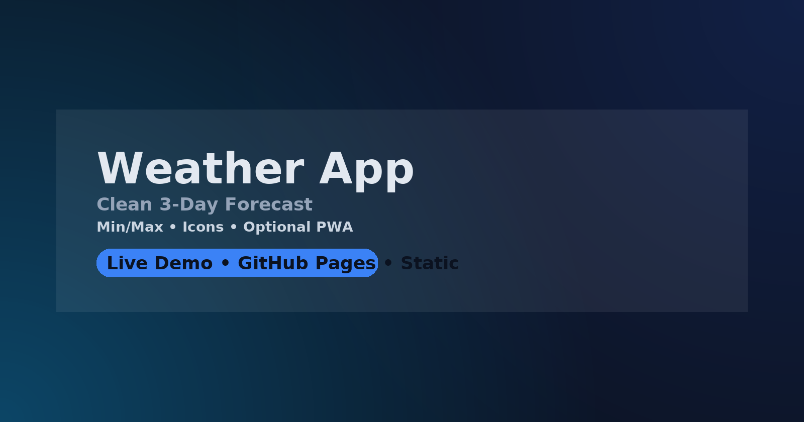

# Weather App — Minimal 3‑Day Forecast

**Live Demo:** https://enesmyildiz.github.io/ns-weather-app/  
_(If your repo is `weather-app`: https://enesmyildiz.github.io/weather-app/ )_  
**Repo:** https://github.com/enesmyildiz/ns-weather-app

A clean UI with **3‑day min/max** forecast and condition icons. Simple, fast, and GitHub Pages‑friendly.

## ✨ Features
- 3‑day min/max forecast; icon set.
- City search, basic error handling.
- (Optional) Geolocation; (Optional) PWA (manifest + offline cache).

## 🚀 Quick Start
1) Open `index.html` locally or deploy via GitHub Pages.  
2) If using an API, check `BASE_URL` in `app.js` (keys‑free **Open‑Meteo** recommended).  
3) Customize icons under `icons/*.svg`.

## 🗺️ Roadmap
- Hourly view, theming, i18n.

## 📝 License
MIT
